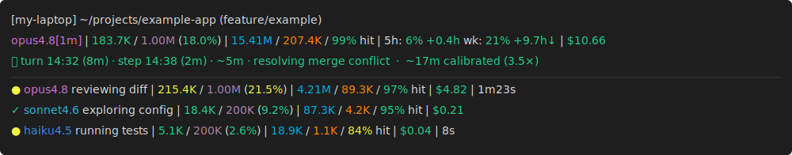

# schoen-claude-status

A two-line [Claude Code](https://claude.com/claude-code) statusline showing
context, session-wide cache hit %, 5-hour and weekly rate-limit usage with
pace projection, and total session cost — all colored by configurable
thresholds.



```
[hostname] /path/to/cwd (branch)
ctx: 183.7K / 1.00M (18.0%) | cache: 15.41M read / 207.4K write / 99% hit | 5h: 6% +0.4h wk: 21% +9.7h | cost: $10.66
```

## What you see

**Line 1** — hostname, current working directory, current git branch (if any).

**Line 2** — pipe-separated metrics; fields are omitted when their data isn't
available:

- **ctx** — tokens used / context window size (used %).
- **cache** — total cache reads / total cache writes / cache hit %, summed
  across the session transcript and any subagent transcripts. (Claude Code's
  stdin payload only carries per-turn cache data, so the script walks the
  JSONL files to get a session-wide number.)
- **5h / wk** — your 5-hour and 7-day Claude Code rate-limit utilization. Each
  is followed by a **pace projection** in absolute hours: `+0.4h` means
  you're on track to finish the window with 24 minutes of compute headroom;
  `-1.3h` means you're projected to hit the cap before the window resets.
  The pace number turns yellow as a close-call warning when the green margin
  shrinks to within 5% of the window length (~15 minutes for the 5h window,
  ~8.4h for the weekly window). Requires Anthropic's `rate_limits` payload
  field — proxy setups (LiteLLM, gateways) typically don't surface it, so
  these fields silently omit on those configurations.
- **cost** — `cost.total_cost_usd` from Claude Code's payload (matches
  `/usage`, includes subagent spend).

## Color thresholds

ctx thresholds gate on raw token counts (the underlying limits — 33K
compact buffer, 200K Opus-1M pricing boundary — are themselves token
quantities, not fractions, so the gating compares tokens directly):

| field        | green       | yellow      | red             |
|--------------|-------------|-------------|-----------------|
| ctx (200K)   | < 100K      | 100–147K    | ≥ 147K          |
| ctx (1M)     | < 200K      | 200–947K    | ≥ 947K          |
| cache hit    | ≥ 90%       | 75–90%      | < 75%           |
| 5h / wk      | < 75%       | 75–90%      | ≥ 90%           |
| cost         | < $25       | $25–$50     | ≥ $50           |
| pace ±X.Yh   | > 5% margin | 0–5% margin | < 0             |

ctx red is computed as `(window_size − 33K compact buffer) − 20K margin`,
giving ~1–2 turns of headroom before auto-compact fires. Set
`CLAUDE_AUTOCOMPACT_PCT_OVERRIDE` (1–100) to override the compact point,
and the red band tracks it.

ctx yellow is **token-anchored on 1M models** (200K, the boundary where
Opus 1M pricing doubles) and **fraction-anchored otherwise** (50%, where
model accuracy starts to degrade — a fill-fraction signal, not a token
target). The 1M case keeps the higher-cost zone visually distinct.

The cost thresholds reflect a personal per-session shape; tweak the
constants in the script if your scale differs.

## Install

```sh
git clone https://github.com/mtschoen/schoen-claude-status.git ~/schoen-claude-status
```

Then point Claude Code at it. In `~/.claude/settings.json`:

```json
{
  "statusLine": {
    "type": "command",
    "command": "bash ~/schoen-claude-status/statusline-command.sh"
  }
}
```

The next render picks up the change — no restart needed.

### Requirements

- `bash`, `python3` (any 3.x), `git` — present on most machines that already
  run Claude Code.
- Claude Code v2.1+ (for the rich JSON payload — earlier versions only sent
  `model` / `session_id` / `cwd`).

## Why this and not [other-statusline]?

Several great Claude Code statuslines already exist; this is just mine, made
public in case it's useful. What it emphasizes:

- **Pace projection in absolute hours**, not burn-rate %, so the headroom
  signal reads as time rather than ratio.
- **Session-wide cache hit %** by walking the transcript and any subagent
  JSONLs (Claude Code's stdin payload only carries per-turn cache data).
- **Single file** with no `jq` dependency — Python heredoc inside bash, no
  install step beyond `git clone`.
- **Two-line layout** so the location row stays uncluttered.

If you want progress bars, themes, or powerline glyphs,
[ccstatusline](https://github.com/sirmalloc/ccstatusline) is great. If you
want pace tracking with burn-rate % deltas,
[claude-pace](https://github.com/Astro-Han/claude-pace) is great.

## Logs

The script truncate-writes the latest stdin payload to
`~/.claude/.statusline-input.log` and any Python errors to
`~/.claude/.statusline-error.log`. Useful for diagnosing layout issues or
seeing what fields a future Claude Code version starts sending.

## License

MIT — see [LICENSE](LICENSE).
